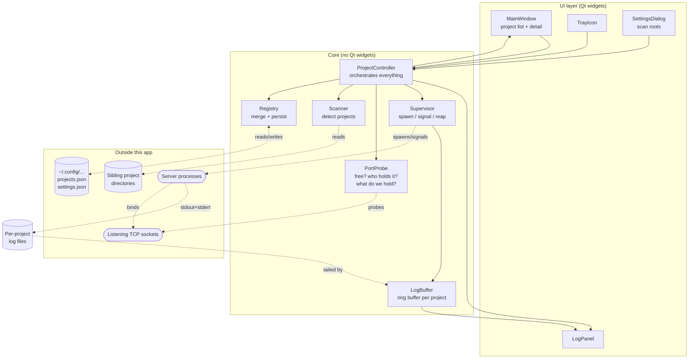

# LocalWebServerManager — Design (Phase B)

> **Status:** Approved by the user on 2026-08-03. Rule-14
> cold-eyes gate: **one loop run**, 2 independent lanes, all
> verified findings fixed — see the loop log at the foot of this
> document for what was found and why the run stopped at one
> loop.
> **Phase:** B — Design.
> **Output:** architecture diagram, components, data flow,
> ADRs in `docs/decisions/`.
> **Gate:** user explicitly approves this document and the
> ADRs before Phase C starts.
> **Source of truth for:** *what is*. ADRs are *why we chose
> this*; specs are *contract for one item*.

Inputs: `docs/discovery.md` (approved 2026-08-03) and the four
Phase B decisions taken with the user on the same date — port
contract via `PORT` with a pre-flight availability check
(ADR-0002), launch each project's own script as a supervised
process group (ADR-0003), runtime truth from probing rather
than memory (ADR-0004), and a persisted registry that survives
rescans (ADR-0005).

**Contents:** [Architecture](#architecture) ·
[Components](#components) · [Detection rules](#detection-rules) ·
[Data flow](#data-flow) ·
[Cross-cutting concerns](#cross-cutting-concerns) ·
[ADRs](#architecture-decision-records) · [Sign-off](#sign-off)

## Architecture

Two rules the diagram encodes:

- **Core never imports `QtWidgets`.** It may use `QtCore`
  (signals, timers) so the UI can bind to it, but every core
  component is testable headless. `pytest-qt` drives signals
  without a visible window.
- **Arrows into `outside` are the only side effects.** Anything
  that touches the filesystem, spawns a process, or opens a
  socket lives behind one of the four core components that own
  those boundaries — which is what makes them fakeable in tests.

## Components

- **MainWindow** — the project list (name, status dot, port,
  uptime) plus a detail pane for the selected project, and the
  **Open in browser** action, which opens
  `http://localhost:<bound port>` via `QDesktopServices` — the
  port actually bound, never the requested one, since the two
  differ exactly in the `running (wrong port)` case where opening
  the wrong one would be useless. The action is enabled in all
  three running states — `running (managed)`,
  `running (wrong port)` and `running (foreign)` — since a
  foreign server is just as openable as one we started. Main responsibility: presenting
  controller state and turning clicks into controller calls. It
  holds no state of its own beyond widget state. **Uptime** comes
  from `psutil.Process(pid).create_time()` of the port holder, so
  it is available for foreign servers too; it is blank when the
  PID cannot be resolved.
- **LogPanel** — a read-only view of one project's recent output,
  following the tail unless the user has scrolled up. Main
  responsibility: rendering a `LogBuffer` without owning it.
  **`QPlainTextEdit`, never `QTextEdit`**, and every widget
  carrying a project name, process name or error string sets
  `Qt.PlainText` explicitly. Qt's default `AutoText` sniffs for
  rich text, so a hostile server printing
  `` gets Qt to load a local
  resource, and deeply nested tags wedge the UI thread in layout.
  Control characters are stripped and long lines elided.
- **TrayIcon** — a status icon with a per-project start/stop menu,
  the same Open-in-browser action, and the app's only genuine
  Quit. Main responsibility: control and status while the window
  is hidden. Closing the window hides to tray; servers keep
  running (user decision, 2026-08-03), and they survive Quit too
  (ADR-0003).
- **SettingsDialog** — edits the scan-root list and per-project overrides. Main
  responsibility: capturing configuration edits and handing them
  to the Registry.
- **ProjectController** — the single object the UI talks to. Main
  responsibility: sequencing the operations that span components
  (start = pre-flight port check → spawn → watch), and emitting
  one `projects_changed` signal the UI renders from.
- **Supervisor** — spawns launchers in their own session, streams
  their merged output, signals them on stop, and reaps them. Main
  responsibility: owning the lifetime of processes this app
  started (ADR-0003).
- **PortProbe** — takes one socket-table snapshot per poll and
  answers three questions from it: *is this port free?*, *what
  holds it?* (port → PID, with the holder's executable path and
  working directory for the plausibility test in ADR-0004), and
  *which ports does this process group hold?* (PID/PGID → ports).
  The third is the reverse lookup, and it is what makes ADR-0002's
  post-flight check implementable — without it, a project that
  ignored `PORT` is indistinguishable from one that bound
  nothing. Main responsibility: being the only component that
  knows how ports are inspected.
- **Scanner** — walks the scan roots and returns candidate
  projects with a detected launcher and declared port, per
  *Detection rules* below. Main responsibility: turning a
  directory tree into `DetectedProject` records. It is strictly
  read-only — it never writes to a sibling project or to config.
- **Registry** — the persisted project list plus the merge rules
  that reconcile a fresh scan against the user's edits. Main
  responsibility: being the source of truth for *what projects
  exist and how the user wants them configured* (ADR-0005).
- **LogBuffer** — a bounded in-memory ring of recent output lines
  per project. Main responsibility: keeping the last N lines
  available for the panel and for post-mortem after a crash,
  without unbounded growth.

## Detection rules

Discovery success criterion 1 is graded on this section: a first
run with no config must find all seven known projects with the
right launcher and port. Detection is therefore specified here
rather than left to the implementer, and it is **advisory** —
every value it produces is correctable in the UI (ADR-0005).

**The default scan root is `~/projects`, and the first run asks.**
It is deliberately not baked to any real machine's layout: a shipped
default pointing at its author's directory tree both fails for
everyone else and publishes where that author keeps their work
(LWSM-1045). If `~/projects` does not exist, the first-run flow asks
for a folder instead of scanning nothing and reporting an empty list.

**Where it looks.** Each scan root's **immediate
subdirectories** are candidate projects, **excluding this
application's own directory** — once P01 lands a `pyproject.toml`
and a run script, the manager would otherwise list and offer to
launch itself. Within a candidate the walk goes at most **3
levels deep** and skips `node_modules`, `.git`, `.venv`, `venv`,
`__pycache__`, `dist`, `build` and `.cache`. Unbounded recursion
is not acceptable on a root whose subdirectories contain
`node_modules`. The whole scan carries a **20-second budget**; on
expiry it returns what it has and says so, rather than hanging a
first run.

**Launcher, first match wins.** A candidate with no match is not
a server project and is not listed.

0. **A systemd user unit for this project**, found by matching
   `systemctl --user list-unit-files` against the project's
   directory name. This outranks everything below it: if systemd
   already owns the server, running its script directly would
   create a second instance fighting the first for the port.
   `project-a` is the known case
   (`project-a.service`). Verbs for these projects go through
   `systemctl` — see [ADR-0003](decisions/0003-launch-via-project-scripts.md)
   § Service-managed projects.
1. An executable `start.sh` or `run.sh` at the project root.
2. `package.json` at the project root with a `scripts.dev` or
   `scripts.start` entry → `npm run <that script>`.
3. A root-level `serve.py`, `server.py` or `app.py` →
   `python3 <file>`.
4. A root-level `serve.mjs` / `serve.js` → `node <file>`.

**Port-bearing file.** Because rule 1 wins for three of the seven
known projects, most ports live one hop away from the launcher.
So before extracting a port, the Scanner resolves **which file
the launcher runs**: it scans the shell script for the last
`exec`, `python3`/`python`, or `node` invocation naming a
file inside the project, and follows **exactly one hop**. One,
not many: `project-e` puts its port two hops out
(`run.sh` → `launcher.py` → `config.py`), and chasing imports is
a static-analysis problem this app has no business solving. That
project is expected to come back *port unknown* and be given a
port by hand on first run — an honest limit, not a bug.

**Declared port, first match wins**, searched in the launcher and
then in the one-hop file. No match leaves the port empty and the
row flagged *port unknown*; the user supplies one and Start is
refused until they do. Guessing would be worse than asking.

1. `PORT=N`, `PORT=${PORT:-N}`, `--port N`, `--port=N`, or
   `localhost:N` / `127.0.0.1:N` anywhere in the file. The
   `${PORT:-N}` form matters: it is how `project-g/run.sh:87`
   declares 8080 while already honouring the contract.
2. An assignment whose left-hand side **ends in** `port` or
   `PORT`, case-insensitive, with an integer literal anywhere on
   the right — `PORT = 8765`, `DEFAULT_PORT = 4322`,
   `'server_port': 5000`, `"port": 5173`, and
   `const PORT = Number(process.env.PROJECT_A_PORT) || 4321`. The
   match is **not anchored to the start of the line**, which is
   what lets it reach `DEFAULT_PORT` and the `|| 4321` fallback;
   the "ends in port" constraint is what stops it matching
   unrelated numbers.
3. A framework default, only when the launcher identifies a
   framework **and** neither rule 1 nor rule 2 found anything:
   Vite `5173`, Flask `5000`, Django `8000`. None of the seven
   known projects currently needs this rule — it exists for
   projects that configure nothing, and if it stays unused it
   should be deleted rather than carried.

**Runtime kind** — `systemd`, `python`, `node`, or `shell` —
follows from the launcher match. It drives which verbs are used
(ADR-0003) and, for the last three, which framework default
applies.

## Custom project actions

The per-project tray applets this manager replaces carry actions
beyond start / stop / open, and they are not the same actions:
one tray offers two *open this file in my editor* actions;
another offers a *refresh my data now* command. Hard-coding either
would be absurd, and dropping them would make the manager a
downgrade from the trays it replaces.

So the registry stores an optional **`actions`** list per
project, rendered as buttons in the detail pane and as entries in
that project's tray submenu. Each action is a label plus one of
three kinds:

| Kind | Meaning | Covers |
|---|---|---|
| `open_file` | open a path in the desktop's default handler | “open this project's notes file” |
| `open_url` | open a URL, with `{port}` substituted for the bound port | project-specific pages beyond the root |
| `run_command` | run an argument vector in the project directory, show its output in the log panel | “refresh this project's data now” |

Rules that keep this from becoming a security hole or a support
burden:

- Actions are **user-authored**, never invented by the Scanner.
  Detection never writes an `actions` entry — a manager that
  discovers commands in a project and offers to run them is a
  different, much riskier product. This is enforced by **type**,
  not by convention: a scan produces a *detected-only* record that
  structurally has no `actions` field, so no future merge can
  promote scanned content into an executable one by forgetting.
- **`open_url` is parsed, not concatenated.** `QUrl`, scheme
  restricted to `http`/`https`, and the port set via
  `QUrl.setPort()` after validating it as an integer in 1–65535.
  Substituting `{port}` into a string before parsing turns a
  non-integer into `http://localhost:0@evil.example/`.
- **`open_file` stays inside the project** — canonicalised and
  `commonpath`-checked — and refuses `.desktop` files and anything
  with the execute bit. `QDesktopServices.openUrl` *launches* those
  rather than displaying them, and a `.desktop` file is exactly
  what a hostile repo ships.
- **`run_command` argv is validated on load** as a non-empty list
  of strings, and rejected with a named error rather than dropped
  silently. The resolved argv appears in the button's tooltip and
  accessible description, which also satisfies § O8.
- `run_command` uses an **argument vector**, never a shell
  string, per `docs/standards/coding.md § O4`.
- An action is disabled while the project is not running only if
  it is marked as requiring the server; the default is that it
  always works, because opening a notes file has nothing to do with
  a running server.
- Failure surfaces in the log panel like any other output.
  Nothing about a custom action can leave the project in a state
  the status poll cannot describe.

### Robustness — detection is a hypothesis, observation is proof

Static rules read other people's code, and other people's code
will not co-operate: Phase D found three of seven inventory rows
wrong when they were built from pattern-matching alone. Making
detection "as robust as possible" (user, 2026-08-03) therefore
means **not relying on reading alone**. Four measures, in
descending order of how much they actually buy:

1. **Confirm by observation, and remember it.** The instant a
   project is seen running — started by us, or found already
   listening with a holder whose working directory is inside the
   project — the app records **the port it actually bound** as a
   `confirmed_port`, and prefers that over anything a rule
   guessed. This is the single most valuable measure, because it
   converts every project into a measured fact after its first
   run and makes the static rules matter only once. It is also
   the only mechanism that reaches a port the rules **cannot**
   read: `project-e` hides its 5002 two hops out, and the
   first time it runs, that stops being a problem forever.

2. **Read more sources, and say where the answer came from.**
   Beyond the launcher and its one-hop file: a `.env` /
   `.env.local` `PORT=`, a systemd unit's `Environment=` and
   `ExecStart` arguments, a `docker-compose.yml` `ports:`
   mapping, and — lowest confidence — a `localhost:NNNN` in the
   project's `README.md`. Each detected value carries **where it
   came from**, shown in the UI, so a wrong guess is diagnosable
   ("port 5000 — from a framework default") rather than
   mysterious.

3. **Disagreement is reported, never silently resolved.** When
   two sources give different ports, the higher-confidence one
   wins *and the conflict is shown*. First-match-wins that hides
   a contradiction is how a wrong value survives unnoticed.

4. **A wrong guess is trivial to fix, and fixing it is
   permanent.** Editing a project's launcher or port is a
   first-class action on the row itself — not buried in a
   settings dialog — because with heuristics over other people's
   code, correction is a normal operation rather than an error
   path. A user-set value is never overwritten by a later scan
   (ADR-0005).

### Everything the Scanner reads is hostile until proven otherwise

The Scanner reads files inside directories this app does not
control, so every read is bounded and every result is inert data
(security review, 2026-08-03):

- **Per-file cap of 256 KB**, read **line by line** with a per-line
  length cap. Measure 2 widens the file set to `README.md` and
  `docker-compose.yml`, and nothing stops one of those being 2 GB.
- **The 20-second budget is checked per line, not per scan.** A
  wall-clock check between files cannot interrupt a regex, and the
  unanchored "left-hand side ending in `port`" pattern is the
  classic catastrophic-backtracking shape. Rule 2 is implemented as
  a non-backtracking two-step — split on `=`, then match `\d+` —
  rather than as one clever pattern.
- **`os.walk(followlinks=False)`, and non-regular files are
  skipped.** A FIFO planted in a scanned directory blocks `open()`
  for ever; a symlinked directory can walk out of the scan root
  entirely.
- **The one-hop launcher target is `commonpath`-checked against the
  project root after resolution.** Otherwise `exec python3
  ../../../.ssh/config` is read, and its contents surface in the UI
  as a detected value.

Detection results are **data, never instructions**: a detected
command is displayed and stored, and only ever executed after the
trust confirmation in ADR-0003.

**Confidence, honestly labelled.** Each project shows one of
*confirmed* (observed running on this port), *detected* (a rule
matched, and which), or *unknown* (nothing matched — the user
supplies it and Start is refused until they do). Guessing a port
and being wrong is worse than asking.

**The regression corpus grows with every mistake.** The
acceptance test for LWSM-1006 runs the rules over a fixture tree
mirroring the seven real projects and asserts launcher and port
for each — including those expected to come back *unknown*. Every
future project that detection gets wrong is **added to that
fixture tree as a case**, so the rules improve monotonically
instead of oscillating. Detection accuracy is a test suite, not
an opinion.

## Look and feel

The default Qt widget style looks like a 2005 configuration
dialog, which is not what a tool you keep open all day should
look like. The app ships its own **theme layer**: a set of
semantic colour tokens, one palette per theme, applied as a
generated Qt style sheet at runtime.

**Themes are switchable without a restart** — changing one
regenerates the style sheet and reapplies it. The choice lives in
`settings.json`.

### The palettes — adopted from `finbreak`, not invented

`finbreak` already solved this well and the user likes the
result, so this project **adopts its theme system rather than
writing a parallel one** (`docs/standards/coding.md § 3`, reuse
before rewriting). Source of truth for the palette values:
`<scan root>/finbreak/src/finbreak/ui/theme.py`.

Six themes, three light and three dark:

| Theme | Kind | Character |
|---|---|---|
| **midnight** *(default dark)* | dark | Deep ground, warm gold accent. |
| **graphite** | dark | Neutral grey with a cool blue accent — the "long session" theme. |
| **emerald** | dark | Dark with a green accent. |
| **ledger** *(default light)* | light | Warm paper ground, muted gold accent. |
| **parchment** | light | Warmer still, softer contrast. |
| **mint** | light | Cool light ground, green accent. |

Plus **Follow system**, which tracks the desktop's light/dark
preference and resolves to `midnight` or `ledger`. Dark is the
default, per the user's stated preference.

### Tokens, not colours

A theme is **nine semantic tokens plus an `is_dark` flag**, the
same shape finbreak uses:

`window` · `base` · `alt_base` · `text` · `muted_text` ·
`accent` · `accent_soft` · `attention` · `border` — and
`is_dark`, which drives the light/dark grouping in the picker.

This project **extends** that set with the six it needs that a
finance app does not — one per project state:
`state_running` · `state_starting` · `state_wrong_port` ·
`state_blocked` · `state_failed` · `state_stopped`.

Widgets name tokens, never colours. Adding a theme means adding a
palette, never touching a widget, and
`docs/standards/coding.md § O7` makes a literal colour in widget
code a review failure. Tokens expand into a `QPalette` (so native
widgets follow) **and** a generated style sheet (for the polish
Qt's palette cannot express) — finbreak's two-layer split, which
is worth copying because a stylesheet-only theme leaves stock
dialogs looking wrong.

The one deliberate divergence: finbreak stores the choice in
`QSettings`; this project stores it in `settings.json` with
everything else, per `docs/standards/coding.md § O6`.

## Accessibility

**The primary user is partially sighted and reads with a screen
magnifier** (user, 2026-08-03). That is not a compliance
checkbox on this project — it is a description of who the app is
for, and it changes the layout, not just the settings screen.

### What magnifier use actually demands

A magnifier shows a small window onto the screen, and the user
pans it. Everything below follows from that one fact:

- **Status is a word first, a colour second.** A coloured dot is
  a small target carrying the most important information in the
  app — the wrong way round for someone panning a lens. Each row
  leads with the **state spelled out** ("running", "port
  blocked"), with colour and glyph as reinforcement. The dot
  supports the word; it does not replace it.
- **Related information sits together.** A project's name, state,
  port and controls are adjacent and readable **within one lens
  view** — never name on the far left and state on the far right,
  which forces a pan and a memory test. This tempers the usual
  "generous spacing" advice: vertical rhythm stays generous,
  horizontal sprawl does not.
- **Feedback appears where the action happened.** A message in a
  far-off status bar is invisible to someone whose lens is on a
  button. Errors and confirmations surface **next to the row or
  control that caused them**, not in a corner.
- **Dialogs open near the focus**, not wherever the compositor
  fancies — a confirmation the user has to go hunting for is a
  confirmation they will dismiss blind.
- **Nothing important is hover-only.** Hover states are easy to
  miss at magnification and impossible to discover by keyboard.
  Every affordance is visible at rest.

### The non-negotiables

**A high-contrast theme ships as a first-class option**, beyond
the six aesthetic ones: maximum-contrast text, heavy borders, a
thick focus ring, no decorative subtlety. Available in light and
dark. This is an assistive tool, not a seventh colour scheme, and
it is not allowed to regress.

**An in-app text-size control**, independent of the desktop's
scaling — 100 % to 200 % — because desktop-wide scaling is a
blunt instrument when only one window needs to be bigger. The
layout must **reflow** at every step, never clip or truncate; the
test asserts no text is elided at 200 %.

**Never colour alone.** The commonest colour blindness is exactly
red/green. Every state carries **at least three signals** —
the word, a distinct glyph, and colour. The test is blunt: *the
status list must be fully readable in greyscale.*

**Focus is unmissable.** A thick, high-contrast focus ring on
every focusable widget in every theme — the magnifier user's
"where am I?" depends on it entirely. The app never steals focus
from what the user is reading.

**Contrast.** Every text-on-background pair in **every** theme
meets **WCAG AA** — 4.5:1 for body text, 3:1 for large text and
for the non-text indicators that carry state. Contrast is
arithmetic, so this is a unit test over the palettes rather than
a matter of taste, and **a new theme cannot be added without
passing it.** The adopted finbreak palettes are checked on
arrival, not assumed: any pair that falls short is adjusted here
and the divergence recorded, since the source app had its own
reasons for its values.

**Full keyboard operation.** Every action — start, stop, restart,
open, rescan, custom actions — is reachable without a mouse, with
a visible focus ring that meets contrast on every theme. Tab
order follows visual order. No action is available only via
double-click, hover, or a tray icon.

**Screen readers.** Every interactive widget gets an accessible
name and description (`setAccessibleName` /
`setAccessibleDescription`); status is exposed as **text**, not
only as a coloured dot, so Orca announces "Wedding Site, running,
port 5005" rather than an unnamed icon. A state change announces
itself once, not on every poll.

**Respects the desktop, not our preferences.** System font family
and size, honouring the desktop's font scaling and high-DPI
settings rather than pinning pixel sizes — the in-app text-size
control multiplies that, it does not replace it. No animation
conveys information, and any decorative animation honours a
reduce-motion preference.

**Targets.** Clickable targets no smaller than 24×24 logical
pixels at 100 %, scaling with the text-size setting rather than
staying fixed while the text around them grows.

**This is tested, not asserted.** `docs/standards/testing.md § T8`
carries the checks: contrast arithmetic across every theme,
keyboard reachability of every action, accessible names on every
interactive widget, and no elided text at 200 %. An
accessibility claim with no test behind it is decoration.

### Everything else

One accent colour used sparingly so it means something; no
gradients pretending to be depth, no bevels, no icon-only buttons
without both a tooltip and an accessible name. A manager utility
should look like it belongs on the desktop it runs on, not like a
web page pretending to be an app.

## Data flow

**Startup.** `ProjectController` asks the `Registry` to load
`projects.json`. If the file is absent (first run) it triggers a
scan and presents the result as a confirmation list. It then
starts the **1-second status poll** (default, settings-backed)
and renders.

**The status poll — the dominant loop.** Every second (default,
settings-backed) the controller takes **one** socket-table
snapshot from `PortProbe` and classifies every known project
against it — one snapshot per tick, never one per project — by
composing two independent sources:

1. What the `Supervisor` knows — do we have a live child for
   this project, and did it exit?
2. What that snapshot shows — is anything listening on the
   project's effective port, which PID owns it, and which ports
   does our own child hold?

The composition rules, the seven resulting states, and why
probing outranks memory are in **ADR-0004**, which is canonical
for all three; this section does not restate them. Success
criterion 2 requires transitions to appear within 2 seconds, and
worst-case latency is one interval plus probe time — which is why
the interval is 1 second rather than 2.

**Starting a project.** Click Start →

1. **Pre-flight.** `PortProbe` checks the project's effective
   port. If something holds it, the launch is refused with a
   message naming the holder (or saying plainly that the holder
   belongs to another user and cannot be named — see
   *Error handling*). The user can pick another port and retry.
2. **Spawn.** `Supervisor` runs the project's own launcher from
   the project directory, in a new session, with `PORT` set to
   the effective port (ADR-0002, ADR-0003).
3. **Stream.** Merged stdout/stderr is redirected to a
   per-project log file and tailed into that project's
   `LogBuffer`, which the `LogPanel` renders live (a file rather
   than a pipe, for the reason in ADR-0003).
4. **Confirm.** The project reads `starting` until it binds
   something — **with no deadline**, since bind time is the
   project's own business and one managed project takes ~40
   seconds (ADR-0004 § Slowness is not failure). Binding the requested
   port makes it `running (managed)`; binding a *different* port
   makes it `running (wrong port)` — the project ignored `PORT`,
   and the UI says so rather than pretending. Exiting, or binding
   **Exiting** without ever binding makes it `failed`, with the
   tail of its log as the explanation — a launcher that exits 0
   having bound nothing is failed, because silence is not success.
   Taking a long time is not failure and never becomes it; past a
   soft threshold the label reads `starting (slow — 42s)`.

**Stopping.** `SIGTERM` to the **process group**, then `SIGKILL`
after the grace period if anything in the group is still alive or
the port is still bound (both conditions — ADR-0003, which is
canonical). Stopping a `running (foreign)` server is allowed but
asks for confirmation naming every process that will be
signalled, because the app did not create it (user decision,
2026-08-03; mechanics in ADR-0004).

**Rescan.** The user presses Rescan → `Scanner` re-walks the
roots → `Registry` merges the result against the stored list and
reports what is new, missing, or changed. User edits are never
silently overwritten (ADR-0005).

## Cross-cutting concerns

### Error handling

Every failure has a visible home: a project-scoped failure shows
on that project's row and in its log panel; an app-scoped failure
(config unreadable, scan root missing) shows in a status bar
message. Nothing is swallowed, and nothing is reported as success
that was not verified — the two shapes this app must get right
are:

- **A port reassignment a project ignored.** The manager sets
  `PORT`, but a launcher that hard-codes its port will bind the
  old one anyway. The poll detects the mismatch and the project
  is marked *not honouring the port contract*, with the port it
  actually bound. It is never shown as running on the requested
  port (ADR-0002).
- **A port holder that cannot be named.** `psutil` resolves the
  owning PID only for processes this user can see — verified on
  this machine 2026-08-03, where 5 of 11 listening sockets were
  attributable and 6 were not. When the PID is unavailable the
  message says the port is held by a process this user cannot
  inspect, rather than inventing an owner or asserting who owns
  it.

Failures during spawn (missing launcher, non-executable script,
launcher exits immediately) all land in the same `failed` state
carrying the log tail, so the UI has one story to tell.

### Observability

Three layers. **Per-project, on disk:** each launched server's
merged output goes to
`~/.local/state/localwebservermanager/logs/<project>.log`
(ADR-0003), capped at 5 MB with one rotation. **Per-project, in
memory:** the `LogBuffer` ring holds the last N lines (default
2000) tailed from that file, live in the panel and retained after
exit so a crash can be read after the fact. A server this manager
never launched — `running (foreign)` — has no log file, and the
panel says so instead of showing an empty view. **App-level:** the
manager's own log at
`~/.local/state/localwebservermanager/app.log`, INFO by default,
rotating at 1 MB with 5 kept — every spawn, signal, port-probe
result and config write, so "why did it say that?" is answerable
later.

No metrics, no telemetry, nothing leaves the machine.

### State management

One `ProjectController` owns runtime state; the UI is a pure
function of it, refreshed via a single Qt signal. There is no
second store and no UI-held copy that could disagree.

The one exception is the **optimistic overlay**, and it is
bounded so it cannot become that second store: when the user
presses Start or Stop, the controller marks that project
`starting` or `stopping` **immediately**, before the next poll,
so the button feels responsive. The overlay lives on the
controller (not in a widget), covers exactly one project, and is
**discarded the moment a poll returns a derived state for that
project**. There is no timeout on it: a slow start keeps the
overlay until a poll disagrees, because nothing here may time out
into a wrong state (ADR-0004 § Slowness is not failure). It never
survives a poll it disagrees with: probing always wins.

Runtime state is **derived, never remembered across restarts.**
Closing and reopening the app re-derives every status from the
live socket table, which is what makes success criterion 3
(truthful status across app restarts) achievable. Only user
*intent* — the project list, aliases, hidden flags, port
overrides, scan roots — is persisted.

Threading: probing and process I/O do not block the UI. Output
reading happens on a reader thread per running project and
crosses into the UI via queued signals; the socket-table probe
runs on a worker so a slow `psutil` call cannot freeze the
window.

### Persistence

Two files under XDG paths:

- `~/.config/localwebservermanager/projects.json` — the registry:
  one record per project (path, display name, launcher, declared
  port, port override, runtime kind, hidden flag, notes, `added`
  timestamp), plus a `schema_version`. The `added` timestamp is
  what breaks a duplicate-port tie (ADR-0005).
- `~/.config/localwebservermanager/settings.json` — scan roots,
  poll interval, slow-start threshold, log-buffer size, tray behaviour.
  It carries its own `schema_version` on the same terms.

Both are written atomically and version-checked on load;
**ADR-0005 is canonical for the mechanics** and this section does
not restate them. No database — at this scale the merge is a
dictionary walk, and a human-readable file that can be hand-fixed
is worth more than query capability.

Nothing is ever written **into** a sibling project directory —
that constraint is in `docs/discovery.md § Out of scope` and is
enforced by the Scanner being read-only.

## Architecture Decision Records

ADRs for non-obvious choices live in
[docs/decisions/](decisions/) — one file per decision,
sequential numbering, never edited after acceptance.

- [ADR-0001](decisions/0001-record-architecture-decisions.md) —
  Record architecture decisions.
- [ADR-0002](decisions/0002-port-contract.md) — The `PORT`
  contract, its pre-flight availability check, and honest
  degradation when a project does not honour it.
- [ADR-0003](decisions/0003-launch-via-project-scripts.md) —
  Launch each sibling's own script via `subprocess` in a new
  session, not `QProcess`.
- [ADR-0004](decisions/0004-runtime-truth-from-probing.md) —
  Derive running state by probing the socket table; adopt and
  guard foreign servers.
- [ADR-0005](decisions/0005-registry-and-rescan.md) — A persisted
  registry whose merge rules never discard user edits.
- [ADR-0006](decisions/0006-managed-mode-signalling.md) —
  `LWSM_MANAGED`, so a sibling suppresses its own tray icon when
  this manager launched it.
- [ADR-0007](decisions/0007-window-geometry-and-centering.md) —
  Window geometry, and why restoring a position under Wayland
  goes through KWin rather than `move()`.

## Sign-off

- [x] Architecture diagram drafted (mermaid renders cleanly).
- [x] Component list captures every box, with main
  responsibility per box.
- [x] Data flow described.
- [x] Cross-cutting concerns each have a one-paragraph
  treatment.
- [x] At least one ADR per non-obvious choice written.
- [x] **User has approved this document and the ADRs.**
  Date: 2026-08-03.

Once approved, proceed to Phase C — write the four
`docs/standards/*.md` files, populate `ROADMAP.md`, and write
specs for the first 1–3 roadmap items.

## Cold-eyes loop log

| Loop | Date | Lanes | C | H | M | L | Outcome |
|---|---|---|---|---|---|---|---|
| 1 | 2026-08-03 | 2 (general-purpose, strong model) | 4 | 5 | 7 | 10 | All 26 verified and fixed across `design.md`, ADR-0001…0005 and `glossary.md`. Run stopped at one loop **on user instruction** (token cost), not on a convergence test — see note below. |
| 2 | 2026-08-03 | 1 (Phase D doc audit, whole A–C set) | 2 | 6 | 6 | 6 | All 21 verified and fixed. Functioned as loop 1's missing cold re-read: it found **fix collateral** (a 2-second poll left behind by loop 1's own interval change) and, more seriously, **factual errors in the project inventory** that loop 1 never checked because it trusted the brief. |

**Loop 1, what it caught.** Both lanes independently led with the
same three defects, which is the strongest corroboration this
gate produces: ADR-0002's fallback rules contradicted each other
(rule 3's "otherwise" swallowed the malformed case rule 4 made an
error); three documents specified three different outcomes for a
project that ignores `PORT`, and the state list had no state for
it; and ADR-0002's post-flight obligation had no mechanism,
because `PortProbe` was only ever given the port → PID direction.
Also fixed: `SIGPIPE` would have killed servers left running past
Quit, since they inherited a pipe the manager owned; the foreign-
stop path would have signalled a process group the manager never
created, potentially taking out an unrelated terminal job;
Scanner detection rules were entirely unspecified while success
criterion 1 is graded on them; and the 2-second poll could not
meet the 2-second transition budget it cited.

**Loop 2, and why the gap it closed mattered.** Loop 1 was capped
at one pass by the user on token cost, leaving its own fixes
un-re-read. Phase D's audit closed that gap and justified the
worry: it caught a 2-second poll interval that loop 1's fixes had
left stranded in the Startup paragraph — classic fix collateral,
invisible to the author who made the change.

It also caught something worse and more useful. **The project
inventory in `docs/discovery.md` was wrong for three of the seven
projects**, because it was built from a shallow grep rather than
by reading the launchers. `project-g` runs a Python backend on
8080 and *already honours `PORT`* — it is not the Vite-on-5173
project the docs claimed; `project-e` launches `launcher.py`,
not `app.py`, with its port two hops away in `config.py`; and
`project-a` already reads `PROJECT_A_PORT`. Four of
the seven turn out to take a port from the environment already.
Every one of those errors had been copied into
`docs/port-contract-prompt.md`, which was about to be pasted into
seven other codebases — so a wrong fact would have shipped seven
times. All verified against the files and corrected.

**The lesson, recorded because it will recur:** a reviewer given
"verified environment facts" in its brief will reasonably trust
them. Loop 1's brief asserted the inventory; loop 2's brief did
not, and asked the reviewer to trace each project through the
detection rules instead — which is what surfaced the errors. Tell
a reviewer what to check, not what is true.
